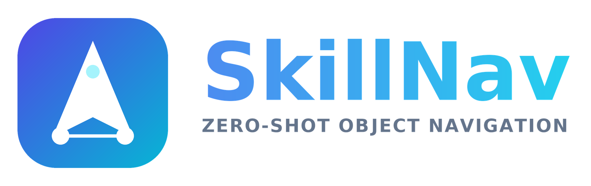
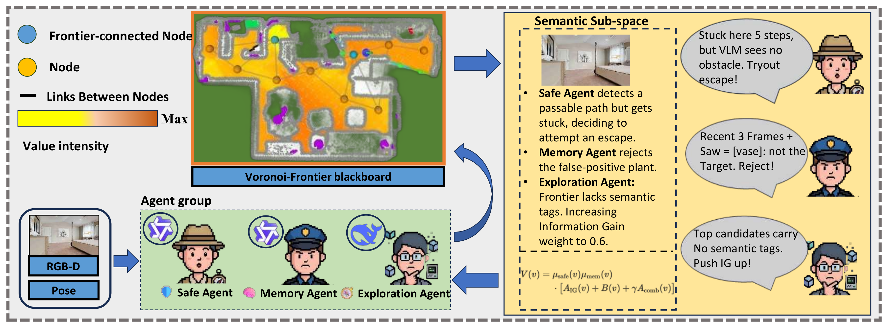

<div align="center">
  <br><br>
  <h3>Multi-Agent Zero-Shot Object Navigation in Habitat</h3>

  <p>
    
    
    
    
    
  </p>
</div>

**SkillNav** is a multi-agent system for zero-shot object navigation. It layers a
decoupled multi-agent controller — **Memory**, **Safe**, and **Exploration** agents —
on top of a C++/ROS frontier-exploration planner core (mapping, frontier exploration,
trajectory generation), driven by a two-prompt **dual ValueMap** that fuses a
semantic-relevance signal (**SR**) with an information-gain signal (**IG**).

The planner core builds on the open-source **[ApexNav](https://github.com/Robotics-STAR-Lab/ApexNav)**
(RA-L 2025); the multi-agent controller, dual ValueMap fusion, Voronoi topology bus,
and the LLM/VLM-driven agents are contributed by this work.

Tested on **Ubuntu 20.04 + ROS Noetic + Python 3.9** (conda env `skillnav`).

<div align="center">
  
</div>

---

## Architecture

```
Habitat (habitat_evaluation.py)
  ├─ dual ITM cosines  →  /blip2_itm/scores  ([SR, IG])
  └─ /target_object, /target_room  (rosparam)
                  │
                  ▼
  C++ planner (exploration_manager)
    MapROS → MultiValueMapManager
      ├─ ValueMap_SR (semantic relevance) → ObjectMap.confidence
      ├─ ValueMap_IG (information gain)
      └─ combined = w_sr·SR + w_ig·IG  →  Voronoi base_value + frontier scoring
    Memory Agent:       candidate targets + multi-frame VLM verification + FP tracking
    Safe Agent:         adaptive escape + VLM dead-zone analysis
    Exploration Agent:  coverage-tiered SR/IG fusion weights
```

The Voronoi topology (`src/planner/plan_env/src/voronoi_topology.cpp`) is the shared
communication bus across agents; nodes carry a read-only `base_value` from the
ValueMap plus per-agent additive/multiplier terms.

## Results on HM3D

Evaluated on the **HM3D ObjectNav val split** (1000 episodes, 500-step horizon,
1 m success radius); SR and SPL follow the standard Habitat protocol. SkillNav
reaches **71.9 SR / 34.0 SPL**, surpassing the strongest published zero-shot
baseline by **+4.1 SR / +2.7 SPL**.

| Method | SR ↑ | SPL ↑ |
|---|:---:|:---:|
| ESC | 39.2 | 22.3 |
| L3MVN | 48.7 | 23.0 |
| VoroNav | 42.0 | 26.0 |
| VLFM | 52.4 | 30.3 |
| OpenFMNav | 52.5 | 24.1 |
| ImagineNav | 53.0 | 23.8 |
| SG-Nav | 54.2 | 24.1 |
| TriHelper | 56.5 | 25.3 |
| InstructNav | 58.0 | 20.9 |
| ImagineNav-Oracle † | 62.0 | 31.1 |
| RATE-Nav | 67.8 | 31.3 |
| **SkillNav (ours)** | **71.9** | **34.0** |

<sub>† Privileged oracle variant with real panoramic captures at candidate poses.</sub>

**Per-category SR (HM3D val):**

| bed | chair | couch | toilet | tv | potted plant | **Overall** |
|:---:|:---:|:---:|:---:|:---:|:---:|:---:|
| 84.2 | 83.1 | 77.5 | 69.9 | 54.8 | 54.6 | **71.9** |

**Per-episode cost of the strategic LM (DeepSeek-Chat):**

| Metric | Value |
|---|---|
| LM calls / episode (mean) | 22.5 |
| Prompt tokens / call (mean) | 527 |
| Total tokens / episode (mean) | 11,885 |
| LM call latency (mean / p95) | 1.95 s / 2.50 s |
| VLM verifier calls / episode | 4.54 |

See the paper for the full evaluation, ablations, and analysis.

## Repository layout

| Path | Contents |
|---|---|
| `src/planner/` | C++/ROS planner: mapping, frontier exploration, dual ValueMap, Voronoi topology, Memory/Exploration agents, trajectory + path search |
| `habitat_evaluation.py` | Habitat-side evaluation loop |
| `habitat_*_control.py` | Manual / velocity-control debug runners |
| `vlm/` | VLM servers (grounding_dino, blip2_itm, sam, yolov7) and dual-prompt ITM scoring |
| `llm/` | LLM prompts and cached answers (Ollama / qwen3 / deepseek) |
| `config/` | Habitat eval configs + per-target two-prompt YAMLs |
| `habitat2ros/`, `basic_utils/`, `scripts/` | ROS bridge, shared utilities, run/analysis scripts |
| `real_world_test_example/` | Habitat-simulated real-world example |

## Setup

```bash
conda env create -f skillnav_environment.yaml   # creates env `skillnav`
conda activate skillnav
```

Keep `numpy==1.23.5` and `numba==0.60.0` (other versions break the numba kernels).

Third-party dependencies cloned separately: `habitat-lab`, `GroundingDINO`, `yolov7`
(`vlm/detector/{groundingdino,yolov7}` are expected to symlink to them). Scene/episode
datasets (HM3D / MP3D) and model weights are downloaded from their official sources and
placed under `data/`.

## Build (catkin)

```bash
catkin_make -DPYTHON_EXECUTABLE=/usr/bin/python3
source ./devel/setup.bash
```

## Run (3 terminals, order matters)

1. **VLM servers** (ports 12181 grounding_dino, 12182 blip2_itm, 12183 sam, 12184 yolov7):
   ```bash
   ./scripts/start_vlm_servers.sh start    # {start|status|stop|restart}
   ```
2. **RViz + roscore:**
   ```bash
   roslaunch exploration_manager rviz.launch
   ```
3. **Habitat evaluator** (the wrapper sets `LD_PRELOAD` to resolve an HDF5 conflict
   between ROS and h5py — always launch through it):
   ```bash
   ./run_habitat.sh --dataset hm3dv2                  # full run
   ./run_habitat.sh --dataset hm3dv2 test_epi_num=10  # 10 episodes
   ```
   Datasets: `hm3dv1`, `hm3dv2` (default), `mp3d`. Configs in `config/habitat_eval_*.yaml`.

## Acknowledgement

SkillNav builds on [ApexNav](https://github.com/Robotics-STAR-Lab/ApexNav) (RA-L 2025).
We thank the ApexNav authors for releasing their planner core.

## Citation

If you find this work useful, please consider citing SkillNav and the ApexNav baseline.

## License

See [`LICENSE`](LICENSE). The ApexNav planner core retains its original license.

## Author

Pandakingxbc &lt;yangzhi0776@163.com&gt;
